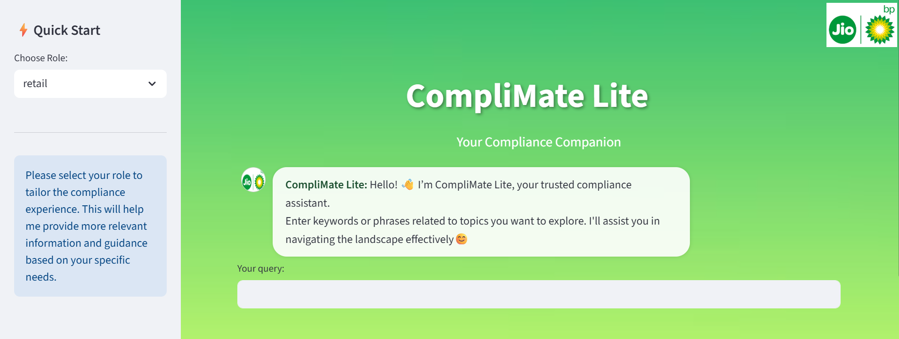

# CompliMate Lite
**CompliMate Lite helps you quickly find relevant rules, sections, and guidelines within petroleum compliance documents — making regulatory navigation simpler and faster.**
## 🎥 Demo
Click to view demo👇🏻:
[](https://github.com/user-attachments/assets/d0a3ea6c-b56d-4518-8f77-70dc5f86e5bd)

---

## 🚀 About the Project

- Your smart companion for quick lookups and clear insights from dense regulatory files.
- **CompliMate Lite** was created as part of an internship program under **Reliance BP Mobility Limited (d/b/a Jio-bp)**.
- This project processes DOCX and PDF regulatory documents using python-docx and pdf2docx, converts their content into searchable embeddings with sentence-transformers, and uses FAISS for fast similarity search to help users quickly find relevant sections. It efficiently manages document metadata and caching to ensure smooth performance.

## ✨ Features

- Uploaded petroleum regulatory files (docx/pdf) are searched through and relevant information as per user queries are retrieved.
- Chatbot style responses
- This app is deployed via Streamlit Community Cloud.
- App auto-updates whenever code is pushed to the main branch on GitHub.
- For live app visit : **[CompliMate Lite](https://complimatelite-bysaranyasarangi.streamlit.app/)**
- Has AI powered version : **[CompliMate](https://github.com/SaranyaSarangi/CompliMate)** 

## 🛠️ Tech Stack

**Frontend & UI**
- [Streamlit](https://streamlit.io/) – for building the interactive user interface

**Document Processing**
- [python-docx](https://python-docx.readthedocs.io/) – for reading DOCX files
- [pdf2docx](https://pypi.org/project/pdf2docx/) – for converting PDF files to DOCX format(process includes conversion of PDF file to DOCX for better retrieval)

**Search & Retrieval**
- [FAISS](https://faiss.ai/) – for efficient similarity search
- [sentence-transformers](https://www.sbert.net/) – for generating text embeddings
- [difflib](https://docs.python.org/3/library/difflib.html) – for fuzzy matching of text

**Data Handling**
- `os`, `json`, `hashlib`, `pickle` – for file handling, metadata storage, caching, and hashing
- Role-based access mapping – for controlling which sections are visible to specific user roles (retail, non_retail)

**Version Control & Deployment**
- [Git](https://git-scm.com/) & [GitHub](https://github.com/) – for version control and code hosting
- [Streamlit Community Cloud](https://streamlit.io/cloud) – for deployment with auto-updates from GitHub

**Source code language**
- 🐍Python

---

## ⚙️ Getting Started

### Prerequisites

- Python 3.10+ (preferably 3.11)
- Streamlit (`pip install streamlit`)
- Other dependencies the app uses (`pip install -r requirements.txt`)

### Installation

1️⃣ Clone the repo  
```bash
git clone https://github.com/SaranyaSarangi/CompliMate_Lite
cd CompliMate_Lite
```

2️⃣ Install dependencies
```bash
pip install -r requirements.txt
```
3️⃣ Upload your compliance documents (DOCX or PDF) in your repo's RAG folder.(optional)

---

## 📦 Usage
- How users can use the app:
Users can enter words or phrases for their concerned topic (e.g. "Certifications","Safety fittings",etc.) and click 'Submit'.

- What output or feedback to expect:
CompliMate Lite will return relevant sections from the files uploaded in RAG folder.

---

## 🛠️ Deployment
You can deploy locally or on your preferred cloud platform (I've mentioned about Streamlit Cloud below):  
1️⃣ Run the app locally:
```bash
streamlit run app.py
```
2️⃣ Run on Streamlit Community Cloud
Push your code to a GitHub repository and deploy your app via [Streamlit Community Cloud](https://streamlit.io/cloud).

---

## 📌Disclaimer
CompliMate Lite can currently work on **petroleum regulatory documents only**.

## 🤝 Contributing
Contributions are welcome! Please fork the repo, create a new branch for your feature/fix, and submit a pull request.

## 📄 License
This project is licensed under the MIT License - see the LICENSE file for details.

## 📞 Contact
- Email : sharanya.sarangi@gmail.com
- [LinkedIn](https://www.linkedin.com/in/saranya-sarangi-5b3745374/)

## 🎉 Acknowledgments
I would like to sincerely thank **Reliance BP Mobility Limited (d/b/a Jio-bp)** for providing me the valuable opportunity to work on this project as part of their internship program. Their support and guidance were instrumental in bringing this project to life.
